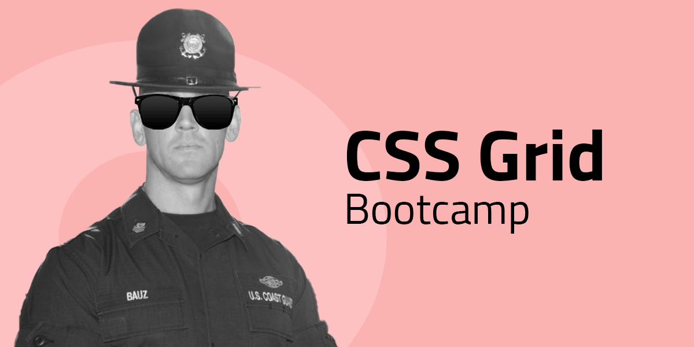

# CSS Grid Bootcamp

## Grid dices
Använd endast HTML och CSS med ett grid för att göra en tärnings 6 olika sidor.

Gridsystemet bör vara uppsatt enligt skissed nedan.

|Bokstav|teknik|
|---|---|
|**A**|static|
|**B**|grid templates|


Förslag på html-struktur:

```html
<article class="dice dots-6">
    <aside></aside>
    <aside></aside>
    <aside></aside>
    <aside></aside>
    <aside></aside>
    <aside></aside>
</article>
```


## Samma layout, olika tekniker

**Static grid** kallas det när *grid-items* placeras ut i grid-systemet med exakta positioner. Här använder man sig av grid-column-start, grid-column-end, grid-row-start och grid-row-end. Ex.

```css
.grid-item {
    grid-column: 3 / 4;
    grid-row: 1 / 2;
}
```

**Flow grid** kallas det när *grid-items* placeras ut i grid-systemet efter ett flöde. Istället för att tala om *var* grid-item ska ligga, så låter man dem följa gridflödet och istället ange dess storlek, dvs. de kolumner och rader som ska tas upp. Ex. 

```css
.grid-item {
    grid-column: auto / span 2;
    grid-row: auto / span 1;
}
```

**Grid templates** är ett tredje sätt att layouta med hjälp av grid som lägger man all layyoutinformation i *grid-containern*. Du namnger varje grid-item, och talar sedan i grid-containern om var den ska ligga med hjälp av strängar. Ex.

```css

.grid-container {
    grid-template-areas:
    "topbar topbar topbar";
    grid-template-rows: 4rem; 
}

.grid-item {
    grid-area: "topbar";
}
```


## 01. Golden layout

|Bokstav|teknik|
|---|---|
|**A**|static|
|**B**|flow|
|**C**|grid templates|
|**D**|responsiv med valfria tekniker|


## 02. Dynamic layout
**Dynamic layout** är en grid-baserad layout som innehåller en *dynamisk yta*, d.v.s en yta som ska kunna växa / minska med innehållet i den.

De dynamiska ytorna visas med en *bakgrundsfärg* i wireframen.

|Bokstav|teknik|
|---|---|
|**A**|flow|
|**B**|grid templates|
|**C**|responsiv med valfria tekniker|


## 03. Complex Dynamic layout
**Complex dynamic layout** är en grid-baserad layout som innehåller flera *dynamiska ytor*, d.v.s ytor som ska kunna växa / minska med innehållet i dem. 

De dynamiska ytorna visas med en *bakgrundsfärg* i wireframen.

|Bokstav|teknik|
|---|---|
|**A**|flow|
|**B**|grid templates|
|**C**|responsiv med valfria tekniker|

